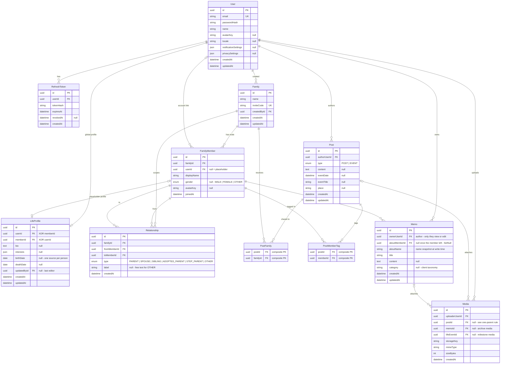

# Database Design

> Status: **full-MVP design** (sprint 0, revised 2026-08-14 after the gap
> review; originally Sprint-1-only, 2026-08-13). Sprint 1 implements its
> subset first. The actual Prisma schema is written when Sprint 1 starts —
> this document is the design reference, `apps/api/prisma/schema.prisma` is
> the source of truth once implemented. All schema changes go through Prisma
> migrations (`CLAUDE.md` § 9.8).

Grounded in the decisions of `docs/00-shared/domain-model.md`:
one global Life Profile per person, placeholder members (no account),
multi-family membership, wiki-editable placeholders, post-to-chosen-families
privacy.

## ER Diagram

Rendered automatically on GitHub and in VS Code Markdown preview
(`Ctrl+Shift+V`, requires the recommended Mermaid extension).

### Full-MVP additions (beyond Sprint 1)

Entities drawn without fields (User, Post, …) are anchors defined in the
core diagram above.

```mermaid
erDiagram
    Comment {
        uuid id PK
        uuid postId FK
        uuid authorUserId FK
        text content
        datetime createdAt
        datetime updatedAt
    }
    Reaction {
        uuid id PK
        uuid postId FK
        uuid userId FK
        enum type "LIKE | LOVE | HAHA | WOW | SAD"
        datetime createdAt
    }
    Album {
        uuid id PK
        uuid ownerUserId FK "private - owner only"
        string name
        text description "null"
        uuid coverMediaId FK "null"
        datetime createdAt
        datetime updatedAt
    }
    AlbumItem {
        uuid albumId FK "composite PK"
        uuid mediaId FK "composite PK"
        datetime addedAt
    }
    LifeEvent {
        uuid id PK
        uuid profileId FK
        string title
        text description "null"
        date eventDate
        string place "null"
        string type "null - taxonomy TBD"
        uuid createdById FK
        uuid updatedById FK "null - last editor"
        datetime createdAt
        datetime updatedAt
    }
    LifeEventMemberTag {
        uuid lifeEventId FK "composite PK"
        uuid memberId FK "composite PK"
    }
    PasswordResetToken {
        uuid id PK
        uuid userId FK
        string tokenHash
        datetime expiresAt
        datetime usedAt "null"
        datetime createdAt
    }
    SpecialDate {
        uuid id PK
        uuid familyId FK
        enum type "BIRTHDAY | ANNIVERSARY | MEMORIAL | CUSTOM"
        string title
        int month "recurs annually"
        int day
        int originYear "null - for ordinals like 50th"
        enum theme "BUNTING | CONFETTI_CANDLES | FLORAL_BORDER | ..."
        uuid createdById FK
        datetime createdAt
        datetime updatedAt
    }
    SpecialDateMember {
        uuid specialDateId FK "composite PK"
        uuid memberId FK "composite PK"
    }
    Notification {
        uuid id PK
        uuid recipientUserId FK
        enum type "see table"
        json payload
        datetime readAt "null - unread"
        datetime createdAt
    }
    VideoJob {
        uuid id PK
        uuid requesterUserId FK
        enum status "PENDING | PROCESSING | DONE | FAILED"
        json inputMediaIds
        string resultStorageKey "null"
        string error "null"
        datetime createdAt
        datetime updatedAt
    }
    EditHistory {
        uuid id PK
        enum entityType "LIFE_PROFILE | LIFE_EVENT"
        uuid entityId "polymorphic - no FK"
        uuid editorUserId FK
        json snapshot "content after edit"
        datetime createdAt
    }
    Plan {
        uuid id PK
        uuid ownerUserId FK "creator - only they edit or share"
        uuid aboutMemberId FK "null - plan for whom"
        string title
        json content "steps - editable draft"
        date occasionDate "null"
        datetime createdAt
        datetime updatedAt
    }
    PlanShare {
        uuid planId FK "composite PK"
        uuid sharedWithUserId FK "composite PK"
        datetime sharedAt
    }

    Post ||--o{ Comment : "has"
    User ||--o{ Comment : "writes"
    Post ||--o{ Reaction : "has"
    User ||--o{ Reaction : "gives"
    User ||--o{ Album : "owns"
    Album ||--o{ AlbumItem : "contains"
    Media ||--o{ AlbumItem : "in"
    LifeProfile ||--o{ LifeEvent : "has"
    LifeEvent ||--o{ LifeEventMemberTag : "involves"
    FamilyMember ||--o{ LifeEventMemberTag : "tagged"
    LifeEvent |o--o{ Media : "attaches"
    User ||--o{ PasswordResetToken : "has"
    Family ||--o{ SpecialDate : "celebrates"
    User ||--o{ SpecialDate : "created"
    SpecialDate ||--o{ SpecialDateMember : "about"
    FamilyMember ||--o{ SpecialDateMember : "honored"
    User ||--o{ Notification : "receives"
    User ||--o{ VideoJob : "requests"
    User ||--o{ EditHistory : "edited"
    User ||--o{ Plan : "owns"
    FamilyMember |o--o{ Plan : "for"
    Plan ||--o{ PlanShare : "shared view-only"
    User ||--o{ PlanShare : "can view"
```

The diagrams mirror the tables below; on any conflict the tables win
(and once implemented, `schema.prisma` wins over both).

## Sprint 1 Entities (detailed)

### User — authenticated account

| Field                | Type     | Notes                                           |
| -------------------- | -------- | ----------------------------------------------- |
| id                   | uuid PK  |                                                 |
| email                | string   | unique                                          |
| passwordHash         | string   | argon2/bcrypt — never plain                     |
| name                 | string   |                                                 |
| avatarKey            | string?  | Media storage key                               |
| locale               | string?  | UI language (screen 20)                         |
| notificationSettings | json?    | Sprint 3.4.5 — shape decided at Sprint 3 design |
| privacySettings      | json?    | Sprint 3.4.4 — shape decided at Sprint 3 design |
| createdAt            | datetime | `@default(now())`                               |
| updatedAt            | datetime | `@updatedAt`                                    |

Google OAuth is deferred (not in the 3-sprint WBS). When added, create a
separate `OAuthAccount` table (userId, provider, providerAccountId) — no
change to `User` needed.

### RefreshToken — JWT refresh tokens, revocable

| Field     | Type      | Notes                                 |
| --------- | --------- | ------------------------------------- |
| id        | uuid PK   |                                       |
| userId    | uuid FK   | → User, cascade delete                |
| tokenHash | string    | store hash, never the raw token       |
| expiresAt | datetime  |                                       |
| revokedAt | datetime? | set on logout / rotation / compromise |
| createdAt | datetime  |                                       |

Index on `userId`. Logout = revoke; refresh rotation recommended.

### Family — family space (group)

| Field                 | Type     | Notes                  |
| --------------------- | -------- | ---------------------- |
| id                    | uuid PK  |                        |
| name                  | string   |                        |
| inviteCode            | string   | unique — join via code |
| createdById           | uuid FK  | → User                 |
| createdAt / updatedAt | datetime |                        |

### FamilyMember — a person's node in one family's tree

| Field       | Type     | Notes                                                          |
| ----------- | -------- | -------------------------------------------------------------- |
| id          | uuid PK  |                                                                |
| familyId    | uuid FK  | → Family, cascade delete                                       |
| userId      | uuid? FK | → User. **null = placeholder** (no account)                    |
| displayName | string   | shown in tree; for linked members may mirror User.name         |
| gender      | enum?    | MALE / FEMALE / OTHER — renders "cha"/"mẹ" labels (task 1.3.5) |
| avatarKey   | string?  |                                                                |
| joinedAt    | datetime |                                                                |

Constraints: `unique(familyId, userId)` (a user appears once per family).
A user in N families has N `FamilyMember` rows — this is the decided
multi-family model.
Display rule for **linked** members: show `User.name` / `User.avatarKey`;
placeholder nodes use their own `displayName` / `avatarKey` (same rule as
LifeProfile display below).
`birthDate` / `deathDate` live on **LifeProfile** (moved 2026-08-14 — one
source of truth per person, no per-family copies).

**Linking flow** (account claims a placeholder): set `userId` on the
placeholder row → its placeholder `LifeProfile` is deleted (bio replaced by
the user's global profile), while Posts/Media tagged to the member row are
kept — they reference `memberId`, which doesn't change.

### LifeProfile — one global profile per person; family-local for placeholders

| Field                 | Type     | Notes                                                                                     |
| --------------------- | -------- | ----------------------------------------------------------------------------------------- |
| id                    | uuid PK  |                                                                                           |
| userId                | uuid? FK | global profile — exactly one per user                                                     |
| memberId              | uuid? FK | placeholder profile — one per unlinked member                                             |
| bio                   | text?    |                                                                                           |
| interests             | json?    | simple list for MVP; AI suggestions come later                                            |
| birthDate             | date?    | moved from FamilyMember (2026-08-14) — one source per person; Sprint 3 reminders query it |
| deathDate             | date?    | deceased members are placeholders                                                         |
| updatedById           | uuid? FK | → User — last editor (wiki edit tracking)                                                 |
| createdAt / updatedAt | datetime |                                                                                           |

Constraint: **exactly one of `userId` / `memberId` is set** (XOR — enforced
in service layer + a DB check constraint). Unique on each.
Display rule: linked member → show the user's global profile; placeholder →
show its member profile (wiki-editable by the family).

### Relationship — edges of the family tree

| Field        | Type     | Notes                                                       |
| ------------ | -------- | ----------------------------------------------------------- |
| id           | uuid PK  |                                                             |
| familyId     | uuid FK  | scoped per family tree                                      |
| fromMemberId | uuid FK  | → FamilyMember                                              |
| toMemberId   | uuid FK  | → FamilyMember                                              |
| type         | enum     | PARENT, SPOUSE, SIBLING, ADOPTED_PARENT, STEP_PARENT, OTHER |
| label        | string?  | free text when type = OTHER (họ hàng xa, …)                 |
| createdAt    | datetime |                                                             |

Constraints: `unique(familyId, fromMemberId, toMemberId, type)`;
`fromMemberId ≠ toMemberId`. Direction convention: PARENT means
_from is a parent of to_. SPOUSE/SIBLING are symmetric — store once,
normalize direction in service layer.

**Kinship labels are derived — do not add enum values for them** (decided
2026-08-14). Grandparents, uncles/aunts (oji/oba), in-laws, cousins, elder
vs younger siblings, … are all computed from graph paths (1–3 hops) +
`gender` + `birthDate` order, viewer-relative, via a kinship-labeling
service + i18n dictionary (vi/ja — ja distinguishes 伯父/叔父 by age vs
the parent). The add-member UI may offer kinship terms as input shortcuts;
the service translates them into base edges (creating placeholder
intermediates when needed).
Removing a member from the family deletes their node and edges (decided
leave-behavior for the tree; content handling is still an open question in
`domain-model.md`).

### Post — content item (posts and events; reused by Memories in Sprint 2)

| Field                 | Type      | Notes                                                       |
| --------------------- | --------- | ----------------------------------------------------------- |
| id                    | uuid PK   |                                                             |
| authorUserId          | uuid FK   | → User                                                      |
| type                  | enum      | POST, EVENT                                                 |
| content               | text?     |                                                             |
| eventDate             | datetime? | for type = EVENT (WBS 1.5.4)                                |
| eventTitle            | string?   | for type = EVENT                                            |
| place                 | string?   | free-text location (screens 10/12/13); Memory Map stays OUT |
| createdAt / updatedAt | datetime  |                                                             |

**PostFamily** (junction): postId + familyId, unique pair — a post can be
shared to **multiple families** (decided). A post with **no** PostFamily
rows is private to its author (visibility "riêng tư", WBS 1.5.5).
Within a family, all members see all its posts — no per-item ACL (decided).

**PostMemberTag** (junction): postId + memberId — tagging members; content
attached to a member survives account-linking (see FamilyMember).

> Sprint 2 note: the Memories page (WBS 2.1) should **reuse this table**
> (filter/group by family, member tags, time), not create a separate
> `Memory` model — same content shown in multiple contexts without
> duplication (`product-overview.md` § 7).

### Media — uploaded files (storage-agnostic)

| Field          | Type     | Notes                                                    |
| -------------- | -------- | -------------------------------------------------------- |
| id             | uuid PK  |                                                          |
| uploaderUserId | uuid FK  | → User                                                   |
| postId         | uuid? FK | → Post, cascade                                          |
| memoId         | uuid? FK | → Memo, cascade — photos attached to a note              |
| lifeEventId    | uuid? FK | → LifeEvent, cascade — media on a milestone (screen 10)  |
| storageKey     | string   | key/path in the storage backend — never a hard-coded URL |
| mimeType       | string   |                                                          |
| sizeBytes      | int      |                                                          |
| createdAt      | datetime |                                                          |

**One-parent rule**: at most one of `postId` / `memoId` / `lifeEventId` is
set (DB check constraint); all null = standalone media (e.g. avatar).

**Storage backend**: access media only through a storage service module in
NestJS. Recommendation for the MVP demo: local disk on the API server;
swap to an S3-compatible bucket later without schema changes (only the
storage service changes). Final choice tracked in
`docs/04-devops/deployment.md`.

### Memo — private notes about a person (WBS 1.6.5; redefined 2026-08-14)

The author's own notes **about a family member** ("mẹ thích hoa cúc", …).
**Always private: only the author can view and edit** (decided 2026-08-14
— no sharing; WBS task 1.6.6 dropped). Photos attach via `Media.memoId`.
Distinct from posts — a memo annotates a person, it is not shared content.
Future AI features (gift/care suggestions) can use memos as context.

| Field                 | Type     | Notes                                                                                  |
| --------------------- | -------- | -------------------------------------------------------------------------------------- |
| id                    | uuid PK  |                                                                                        |
| ownerUserId           | uuid FK  | → User — the author; only they view/edit                                               |
| aboutMemberId         | uuid? FK | → FamilyMember, **SetNull** — null once the member left/was removed (see Decision Log) |
| aboutName             | string   | name snapshot at write time — orphaned notes stay readable (added 2026-08-19)          |
| title                 | string   | the bold card line — added 2026-08-19, UI-led (see Decision Log)                       |
| content               | text?    | the longer body — optional since `title` arrived                                       |
| category              | string?  | client taxonomy (hobbies/health/gift/memories/todo) — free text like `LifeEvent.type`  |
| createdAt / updatedAt | datetime |                                                                                        |

Index on `(ownerUserId, aboutMemberId)`.

## Remaining MVP Entities (detailed — designed sprint 0, 2026-08-14)

Designed alongside the Sprint 1 set so the whole MVP shares one schema
direction. All are scheduled as sub-tasks of existing sprint sections
(added 2026-08-14): Comment/Reaction → 1.5.6–1.5.7, password recovery →
1.1.7, personal albums → 1.6.7, LifeEvent timeline → 1.6.8, special-date
widgets → 1.2.5 (derived sources) and `SpecialDate` CRUD → 3.2.3.

### Comment — comment on a post (screens 12, 19)

| Field                 | Type     | Notes                  |
| --------------------- | -------- | ---------------------- |
| id                    | uuid PK  |                        |
| postId                | uuid FK  | → Post, cascade delete |
| authorUserId          | uuid FK  | → User                 |
| content               | text     |                        |
| createdAt / updatedAt | datetime |                        |

Index on `postId`. Feeds Notification (screen 19: comment notifications).

### Reaction — like/reaction on a post (screen 12)

| Field     | Type     | Notes                                                                                              |
| --------- | -------- | -------------------------------------------------------------------------------------------------- |
| id        | uuid PK  |                                                                                                    |
| postId    | uuid FK  | → Post, cascade delete                                                                             |
| userId    | uuid FK  | → User                                                                                             |
| type      | enum     | LIKE / LOVE / HAHA / WOW / SAD — diverse set (decided 2026-08-14); final icons/labels at UI design |
| createdAt | datetime |                                                                                                    |

Constraint: `unique(postId, userId)` — one reaction per user per post;
changing type = update, removing = delete.

### Family Memory Library — kho ký ức gia đình (screens 5/13; spec #5)

**Decided 2026-08-14: no Album table.** Each family's memory library is a
**derived view**: all media of the posts shared to that family.

    Media → Post (postId) → PostFamily (familyId = X)

Screen 13's filters map to existing columns: by member (`PostMemberTag`),
by time (`Post.createdAt` / `eventDate`), by event (`Post.type = EVENT`),
by place (`Post.place`). Content enters the library by posting to the
family — there is no separate "add to album" flow.

Consequences to confirm at review:

- **Personal albums are a separate, real thing** (decided 2026-08-14):
  user-curated, added manually, **private to the owner** — see the `Album`
  section below (screen 11 "choose album"). The profile gallery (screen 8)
  is a third surface, also derived — see Profile gallery below.
- Auto-albums (AI, spec #8 — unscheduled) would build on the same `Album`
  tables when scheduled.

### Album + AlbumItem — personal albums, private (decided 2026-08-14; screen 11)

Personal, user-curated, **private** collections — visible to the owner
only, never shown on the profile. Unlike the family library, the owner
**adds items manually**.

| Field                 | Type     | Notes                  |
| --------------------- | -------- | ---------------------- |
| id                    | uuid PK  |                        |
| ownerUserId           | uuid FK  | → User, cascade delete |
| name                  | string   |                        |
| description           | text?    |                        |
| coverMediaId          | uuid? FK | → Media                |
| createdAt / updatedAt | datetime |                        |

**AlbumItem** (junction): albumId + mediaId (unique pair, cascade both
ways) + addedAt. Content rule (decided 2026-08-14): owners add only media
**they uploaded** (their own posts' photos or standalone uploads). To keep
another member's shared photo, download it and re-upload — no cross-owner
references, so album items are unaffected by the original uploader
deleting a post or leaving a family. Screen 11 "choose album" = optionally
add the posted photos to one of your albums at post time.

### Profile gallery & timeline photos — derived (screen 8; task 1.6.4)

Photos on a member's profile are **not** their private albums: they are
derived from the member's **shared** content — media of posts authored by
or tagged with the member, plus life-event media — filtered by the
families the viewer shares with that member (enforced in the service
layer). No table.

**Done 2026-08-19** (`GalleryService`): `GET /me/gallery` and
`GET /families/:familyId/members/:memberId/gallery`, same profile
resolution as the rest of the Life Profile (linked → global, placeholder →
local). Not paginated — one person's own history, same choice already
made for the life-event timeline. See `api-contract.md` § Gallery.

### LifeEvent — life milestone (screens 9–10; core domain term)

| Field                 | Type     | Notes                                                    |
| --------------------- | -------- | -------------------------------------------------------- |
| id                    | uuid PK  |                                                          |
| profileId             | uuid FK  | → LifeProfile, cascade — works for users & placeholders  |
| title                 | string   |                                                          |
| description           | text?    |                                                          |
| eventDate             | date     | timeline ordering (screen 9)                             |
| place                 | string?  | screen 10                                                |
| type                  | string?  | screen 9 filters by life stage/event type — taxonomy TBD |
| createdById           | uuid FK  | → User — wiki-editable like the profile                  |
| updatedById           | uuid? FK | → User — last editor                                     |
| createdAt / updatedAt | datetime |                                                          |

**LifeEventMemberTag** (junction): lifeEventId + memberId — "members
involved" (screen 10). Media attaches via `Media.lifeEventId`.

### EditHistory — wiki edit log (decided 2026-08-14)

Placeholder profiles and life events are wiki-editable; every edit writes
a history row so history display / undo can be added later without data
loss. **Write-only for MVP** (no UI yet). `updatedById` on the entities
stays as the denormalized "last editor".

| Field        | Type     | Notes                                    |
| ------------ | -------- | ---------------------------------------- |
| id           | uuid PK  |                                          |
| entityType   | enum     | LIFE_PROFILE, LIFE_EVENT                 |
| entityId     | uuid     | polymorphic — validated in service layer |
| editorUserId | uuid FK  | → User                                   |
| snapshot     | json     | entity content **after** the edit        |
| createdAt    | datetime |                                          |

Index on `(entityType, entityId, createdAt)`.

### PasswordResetToken — password recovery (screen 3)

| Field     | Type      | Notes                           |
| --------- | --------- | ------------------------------- |
| id        | uuid PK   |                                 |
| userId    | uuid FK   | → User, cascade delete          |
| tokenHash | string    | store hash, never the raw token |
| expiresAt | datetime  | short-lived (~1h)               |
| usedAt    | datetime? | single-use                      |
| createdAt | datetime  |                                 |

Same pattern as `RefreshToken`. Requires an email-sending decision when
scheduled (no email infrastructure is planned yet).

### SpecialDate — recurring occasions & home widgets (screens 5, 17; added 2026-08-14)

Upcoming occasions render as **themed countdown widgets** on the family
home ("ANNIVERSARY · BUNTING — IN 3 DAYS — 50th anniversary") and feed
Sprint 3 reminders + screen 17 (Special Date Detail). Countdowns are
computed at display time, never stored. Two sources:

- **Derived, automatic** (no rows): birthdays from `LifeProfile.birthDate`
  ("Dad turns 63" — ordinal computed from birth year) and memorials from
  `LifeProfile.deathDate`. Default theme per type (confetti & candles,
  floral border).
- **User-created** (`SpecialDate` rows): anniversaries and custom family
  occasions — these have no derivable source (e.g. a wedding date is not
  stored anywhere else).

| Field                 | Type     | Notes                                                                |
| --------------------- | -------- | -------------------------------------------------------------------- |
| id                    | uuid PK  |                                                                      |
| familyId              | uuid FK  | → Family, cascade — widget shows on this family's home               |
| type                  | enum     | BIRTHDAY, ANNIVERSARY, MEMORIAL, CUSTOM                              |
| title                 | string   | "50th anniversary"                                                   |
| month / day           | int      | recurs annually                                                      |
| originYear            | int?     | for ordinals ("50th", "turns 63")                                    |
| theme                 | enum     | BUNTING, CONFETTI_CANDLES, FLORAL_BORDER, … — final set at UI design |
| createdById           | uuid FK  | → User                                                               |
| createdAt / updatedAt | datetime |                                                                      |

**SpecialDateMember** (junction): specialDateId + memberId — who the
occasion is about (an anniversary tags the couple).

Sprint 3 reminders generate `Notification` rows from **both** sources
(derived + `SpecialDate`).

Dates are **solar (Gregorian)** — the product targets the Japanese market
(decided 2026-08-14). Japanese memorial ordinals (回忌: 一周忌, 三回忌, …)
are computed at display time from `deathDate`, not stored.

### Notification — in-app notification (Sprint 3.1; screen 19)

| Field           | Type      | Notes                                                                                                                                                            |
| --------------- | --------- | ---------------------------------------------------------------------------------------------------------------------------------------------------------------- |
| id              | uuid PK   |                                                                                                                                                                  |
| recipientUserId | uuid FK   | → User, cascade delete                                                                                                                                           |
| type            | enum      | NEW_POST, COMMENT, REACTION, MEMBER_TAG, FAMILY_INVITE, BIRTHDAY_REMINDER, EVENT_REMINDER, CARE_REMINDER, AI_SUGGESTION — from screen 19 (On This Day items OUT) |
| payload         | json      | type-specific data (postId, memberId, date, …)                                                                                                                   |
| readAt          | datetime? | null = unread — read/unread (3.1.3) + badge count (3.1.4)                                                                                                        |
| createdAt       | datetime  |                                                                                                                                                                  |

Index on `(recipientUserId, readAt)`. Reminders (Sprint 3.2–3.3) generate
rows here — no standalone Reminder table. Delivery is in-app only for MVP
(`sprint-03.md` note).

### VideoJob — async commemorative video generation (Sprint 2.2)

| Field                 | Type     | Notes                                |
| --------------------- | -------- | ------------------------------------ |
| id                    | uuid PK  |                                      |
| requesterUserId       | uuid FK  | → User                               |
| status                | enum     | PENDING / PROCESSING / DONE / FAILED |
| inputMediaIds         | json     | selected media ids (2.2.1)           |
| resultStorageKey      | string?  | set when DONE                        |
| error                 | string?  | set when FAILED                      |
| createdAt / updatedAt | datetime |                                      |

### Plan + PlanShare — saved AI plans (designed 2026-08-14; **feature dropped 2026-08-20**)

> **The feature these two tables exist for is not being built.** Quality
> Time (WBS 2.6) was dropped on 2026-08-20 —
> `project-status.md` → Important Decisions. The Plan API written for it
> was verified but not merged — branch `feature/plans`, if this is ever
> revived.
>
> **`Plan` is nevertheless in live use (corrected 2026-08-24)** — the AI
> team's gift-save (sprint-2 group 2.4) reuses it as its storage:
> `ai.service.ts#saveGiftIdea` writes one row per ♡-saved gift idea
> (`title` convention `gift:<name>`, `content` JSON
> `{ kind: 'gift_idea', why, price_range }`, `aboutMemberId` = the
> recipient, owner-private like the original design), and
> `ai-context.service.ts` reads them back as `past_gifts` so a saved gift
> is never re-suggested. **Do not drop `Plan` as unused.** `PlanShare`
> alone is genuinely empty and unread.
>
> The design below is kept as the record of what was decided; the
> Quality Time semantics (shared view-only plans etc.) describe nothing
> running.

AI-drafted surprise / quality-time plans are **saved** — they are followed
over days, unlike read-once gift ideas. **Private to the creator; only the
creator edits and shares.** Sharing grants **view-only** access to chosen
users (e.g. the co-conspirators of a surprise — the target naturally stays
excluded). Gift-idea and message suggestions remain request/response, not
persisted.

| Field                 | Type     | Notes                                           |
| --------------------- | -------- | ----------------------------------------------- |
| id                    | uuid PK  |                                                 |
| ownerUserId           | uuid FK  | → User, cascade — creator; only they edit/share |
| aboutMemberId         | uuid? FK | → FamilyMember — who the plan is for            |
| title                 | string   |                                                 |
| content               | json     | steps/details — AI draft, editable by the owner |
| occasionDate          | date?    | e.g. the Sunday of the surprise                 |
| createdAt / updatedAt | datetime |                                                 |

**PlanShare** (junction): planId + sharedWithUserId (unique pair, cascade
both ways) + sharedAt — view-only; shared with **users** (accounts), since
viewing requires login.

### Still deferred (sketch only)

- **MemoryBox** (time capsule): box + items + unlockAt — blocked on the
  unlock-semantics open question in `domain-model.md`; not scheduled.
- **OAuthAccount** (Google login): userId, provider, providerAccountId —
  add when OAuth is scheduled; no change to `User` needed.
- AI suggestion features (Sprint 2.3–2.6) remain request/response — no
  persistent tables required for MVP beyond logging, if desired.

## Decision Log (review closed 2026-08-14)

Post-review additions:

- **`MediaInsight` — the hidden AI store (2026-08-19, migration
  `20260819071710`)**: one row per photo — `{ id, mediaId UK (cascade),
insight Json, model, createdAt/updatedAt }` — holding vision-extracted
  facts written only through the internal AI ingest route and exposed by
  no user-facing API; folded into suggestion context filtered by the
  requester's visibility of the source photo. Cascade with `Media`:
  deleting a picture withdraws its traces. Table 26 — the first addition
  beyond the sprint-0 25; full design in `docs/03-ai/architecture.md`.
- **Memos survive member removal (2026-08-19, migration
  `20260819052340`)**: `aboutMemberId` went nullable with **ON DELETE SET
  NULL** (was CASCADE) and `aboutName` snapshots the member's display name
  at write time. A memo is the author's private notebook — another person
  deleting a placeholder, or a linked member leaving, must not destroy it.
  Orphaned notes (`aboutMemberId: null`) stay readable via `aboutName` and
  are listed by `GET /me/memos`. The migration backfills `aboutName` from
  the current members, so it deploys on non-empty tables.
- **Memo grew `title` + `category`, `content` went optional (2026-08-19,
  migration `20260819042417`)**: the memo UI built on 2026-08-19 designs a
  card with a bold title line and a category chip
  (hobbies/health/gift/memories/todo), which one `content` blob cannot
  carry. UI leads, backend follows — the same principle as per-spot
  invitations. `category` is stored as free text and the client owns the
  vocabulary, exactly like `LifeEvent.type`, so a taxonomy change is not
  an enum migration.

All items from the 2026-08-14 design review are resolved:

- **Scheduling**: everything slotted into existing sprint sections —
  password recovery 1.1.7, special-date widgets 1.2.5, Comment/Reaction
  1.5.6–1.5.7, personal albums 1.6.7, LifeEvent timeline 1.6.8,
  `SpecialDate` CRUD 3.2.3.
- **Reactions**: base enum LIKE / LOVE / HAHA / WOW / SAD ships now;
  final icons/labels are a UI decision (adding a value later = enum
  migration).
- **Memo is always private** (2026-08-14): only the author views/edits —
  `isShared` removed, WBS task 1.6.6 dropped.
- ~~**Plans are saved** (2026-08-14)~~ — **superseded 2026-08-20: the
  Quality Time feature was dropped.** Gift/message _suggestions_ stay
  request/response. **Corrected 2026-08-24**: the `Plan` table itself is
  not unused — gift-save writes ♡-saved gift ideas into it (see the Plan
  section above); only `PlanShare` is empty.
- Earlier same-day resolutions: albums split (family library derived /
  personal albums private / profile gallery derived); Memo = private
  notes about a member; `birthDate`/`deathDate` on `LifeProfile`;
  `EditHistory` for wiki edits; solar-only dates (Japanese market).

Remaining domain questions (do **not** block the schema): leave semantics
for posted content, and time-capsule unlock — see `domain-model.md`.

## Design Rules

- Every schema change = Prisma migration, committed with the code.
- IDs are uuid (matches existing `User` model).
- Do not expose Prisma models directly as API contracts — map through DTOs
  (`CLAUDE.md` § 5).
- The development database is **shared Neon Cloud PostgreSQL** (2026-08-26).
  Author a migration against a database of your own — the opt-in local Docker
  Postgres or your own Neon branch — and apply the reviewed one to shared with
  `prisma migrate deploy`. Never `prisma migrate reset` or `prisma migrate dev`
  against the shared branch. Both workflows and the full rules:
  `docs/04-devops/local-environment.md` § Neon rules.
